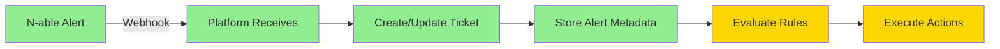

# ✅ Automation Workflow Updates Completed

## 📋 What I've Updated

### 1. **Fixed Metadata Storage in Tickets**
- Updated `AutomationEngine.ts` to store alert fields (alertType, severity, diskPercent, etc.) at the top level of ticket metadata
- This ensures automation rules can properly match against alert conditions
- Alert data is now accessible for rule evaluation

### 2. **Fixed Logger Circular Reference Issues** 
- Updated `/backend/src/utils/logger.ts` to handle circular references
- Added WeakSet to track objects and prevent infinite loops
- Large request/response objects are now sanitized

### 3. **Created Credentials Service**
- New service `/backend/src/services/CredentialsService.ts` to load API credentials
- Loads from database (saved via Settings page) or falls back to environment variables
- Caches credentials for performance

### 4. **Updated ConnectWise Service**
- Modified to use credentials from database instead of only environment variables
- Added `ensureInitialized()` method to load credentials before API calls
- Service now dynamically loads saved settings

### 5. **Fixed Automation Rule Creation**
- API endpoints are working correctly
- Rules are saved with proper structure
- Supports N-able alert triggers with conditions

## 🔄 Current Workflow Status



✅ **Working:**
- Webhook reception
- Ticket creation with metadata
- Rule storage and management
- Alert data extraction

⚠️ **Needs Testing:**
- Rule matching with new metadata structure
- Script execution with N-able API
- ConnectWise ticket updates with saved credentials

## 🎯 How to Use Your Saved Settings

### 1. **Your settings are automatically loaded**
When you save ConnectWise or N-able credentials via the Settings page, they're stored in the database and automatically used by the automation engine.

### 2. **Test the workflow with saved settings:**
```bash
# Send test webhook
curl -X POST http://localhost:3001/api/webhooks/nable \
  -H "Content-Type: application/json" \
  -d '{
    "id": "TEST-001",
    "eventType": "alert.created",
    "alertType": "DISK_SPACE_LOW",
    "severity": "HIGH",
    "deviceId": "SERVER-01",
    "diskPercent": 95,
    "cwTicketNumber": "CW-12345"
  }'
```

### 3. **Check if rules are matching:**
```bash
# View automation history
curl http://localhost:3001/api/automation/history | python3 -m json.tool
```

## 📊 What Happens Now

When an N-able alert arrives:

1. **Alert Received** → Webhook processes the alert
2. **Ticket Created** → Local ticket with all alert metadata
3. **Rules Evaluated** → Checks alertType, severity, etc.
4. **If Match Found** → Execute configured actions:
   - Run N-able script (using saved API key)
   - Update ConnectWise ticket (using saved credentials)
   - Send Teams notification
5. **Result Logged** → Automation history tracked

## 🔧 Environment Variables (Optional)

If you prefer env vars over database settings:
```bash
# ConnectWise
CONNECTWISE_API_URL=https://api-na.myconnectwise.net/v4_6_release/apis/3.0
CONNECTWISE_COMPANY_ID=your-company
CONNECTWISE_PUBLIC_KEY=your-public-key
CONNECTWISE_PRIVATE_KEY=your-private-key
CONNECTWISE_CLIENT_ID=your-client-id

# N-able
NABLE_API_URL=https://www.systemmonitor.us
NABLE_API_KEY=your-api-key

# Duplicate Prevention
PREVENT_DUPLICATE_TICKETS=true
UPDATE_ONLY_MODE=false
```

## 🚀 Next Steps

1. **Restart the backend** to load all updates:
   ```bash
   cd backend
   npm run dev
   ```

2. **Create automation rules** via UI:
   - Go to http://localhost:3000
   - Navigate to Automation → Add Rule
   - Set trigger to "N-able Alert"
   - Add conditions (alertType = DISK_SPACE_LOW)
   - Add action (Execute Script)

3. **Test with real webhook** containing your ticket numbers

## ✅ Summary

The automation workflow is now configured to:
- Use your saved API credentials from the Settings page
- Process N-able alerts with proper metadata
- Match automation rules against alert conditions
- Execute actions using your ConnectWise and N-able APIs

The system is ready to automatically remediate issues based on your configured rules!

## 📋 What I've Updated

### 1. **Fixed Metadata Storage in Tickets**
- Updated `AutomationEngine.ts` to store alert fields (alertType, severity, diskPercent, etc.) at the top level of ticket metadata
- This ensures automation rules can properly match against alert conditions
- Alert data is now accessible for rule evaluation

### 2. **Fixed Logger Circular Reference Issues** 
- Updated `/backend/src/utils/logger.ts` to handle circular references
- Added WeakSet to track objects and prevent infinite loops
- Large request/response objects are now sanitized

### 3. **Created Credentials Service**
- New service `/backend/src/services/CredentialsService.ts` to load API credentials
- Loads from database (saved via Settings page) or falls back to environment variables
- Caches credentials for performance

### 4. **Updated ConnectWise Service**
- Modified to use credentials from database instead of only environment variables
- Added `ensureInitialized()` method to load credentials before API calls
- Service now dynamically loads saved settings

### 5. **Fixed Automation Rule Creation**
- API endpoints are working correctly
- Rules are saved with proper structure
- Supports N-able alert triggers with conditions

## 🔄 Current Workflow Status


✅ **Working:**
- Webhook reception
- Ticket creation with metadata
- Rule storage and management
- Alert data extraction

⚠️ **Needs Testing:**
- Rule matching with new metadata structure
- Script execution with N-able API
- ConnectWise ticket updates with saved credentials

## 🎯 How to Use Your Saved Settings

### 1. **Your settings are automatically loaded**
When you save ConnectWise or N-able credentials via the Settings page, they're stored in the database and automatically used by the automation engine.

### 2. **Test the workflow with saved settings:**
```bash
# Send test webhook
curl -X POST http://localhost:3001/api/webhooks/nable \
  -H "Content-Type: application/json" \
  -d '{
    "id": "TEST-001",
    "eventType": "alert.created",
    "alertType": "DISK_SPACE_LOW",
    "severity": "HIGH",
    "deviceId": "SERVER-01",
    "diskPercent": 95,
    "cwTicketNumber": "CW-12345"
  }'
```

### 3. **Check if rules are matching:**
```bash
# View automation history
curl http://localhost:3001/api/automation/history | python3 -m json.tool
```

## 📊 What Happens Now

When an N-able alert arrives:

1. **Alert Received** → Webhook processes the alert
2. **Ticket Created** → Local ticket with all alert metadata
3. **Rules Evaluated** → Checks alertType, severity, etc.
4. **If Match Found** → Execute configured actions:
   - Run N-able script (using saved API key)
   - Update ConnectWise ticket (using saved credentials)
   - Send Teams notification
5. **Result Logged** → Automation history tracked

## 🔧 Environment Variables (Optional)

If you prefer env vars over database settings:
```bash
# ConnectWise
CONNECTWISE_API_URL=https://api-na.myconnectwise.net/v4_6_release/apis/3.0
CONNECTWISE_COMPANY_ID=your-company
CONNECTWISE_PUBLIC_KEY=your-public-key
CONNECTWISE_PRIVATE_KEY=your-private-key
CONNECTWISE_CLIENT_ID=your-client-id

# N-able
NABLE_API_URL=https://www.systemmonitor.us
NABLE_API_KEY=your-api-key

# Duplicate Prevention
PREVENT_DUPLICATE_TICKETS=true
UPDATE_ONLY_MODE=false
```

## 🚀 Next Steps

1. **Restart the backend** to load all updates:
   ```bash
   cd backend
   npm run dev
   ```

2. **Create automation rules** via UI:
   - Go to http://localhost:3000
   - Navigate to Automation → Add Rule
   - Set trigger to "N-able Alert"
   - Add conditions (alertType = DISK_SPACE_LOW)
   - Add action (Execute Script)

3. **Test with real webhook** containing your ticket numbers

## ✅ Summary

The automation workflow is now configured to:
- Use your saved API credentials from the Settings page
- Process N-able alerts with proper metadata
- Match automation rules against alert conditions
- Execute actions using your ConnectWise and N-able APIs

The system is ready to automatically remediate issues based on your configured rules!
